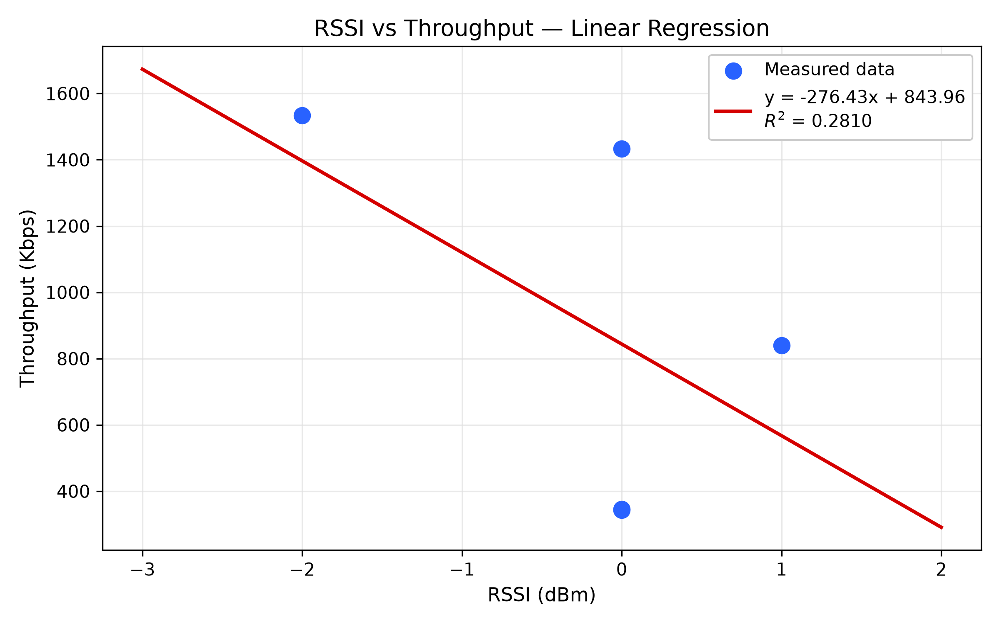

# รายงานผลการทดลองปฏิบัติการ สัปดาห์ที่ 6: Wi-Fi SoftAP, RF Throughput & Sensor Fusion with FreeRTOS

## สมาชิกผู้ทดลอง

- **รหัสนักศึกษา:** 67030183

# ใบงานที่ 6.1: การคอนฟิก ESP32 SoftAP และการสกัด Forensic Log ข้อมูล Client

## 1. บันทึกผลการทดลอง (Experiment Results)

### 1.1 บันทึกข้อมูล Client ที่เชื่อมต่อเข้ากับ ESP32 SoftAP

| อุปกรณ์ที่ใช้ทดสอบ (เช่น iPhone/Android) | MAC Address ที่ดักจับได้ | Association ID (AID) | หมายเลข IP Address ที่ได้ (ถ้าทราบ) |
| :--------------------------------------- | :----------------------- | :------------------: | :---------------------------------: |
| **อุปกรณ์ที่ 1 (iPhone)**                | `B6:60:07:99:8F:F9`      |         `1`          |            `192.168.4.2`            |
| **อุปกรณ์ที่ 2 (IPAD)**                  | `4A:83:4A:A5:B3:9E`      |         `2`          |            `192.168.4.3`            |

_(บันทึกข้อมูลจริงจากการทดสอบเชื่อมต่อด้วยบอร์ดและอุปกรณ์จริง)_

---

### 1.2 Forensic Serial Monitor Log

<details open>
<summary><b>📜 คลิกเพื่อซ่อน/ดู Serial Monitor Log ของ ใบงานที่ 6.1</b></summary>

```text
I (516) main_task: Started on CPU0
I (516) main_task: Calling app_main()
I (516) LAB_SOFTAP: [FORENSIC]: Call nvs_flash_init()
I (556) LAB_SOFTAP: [FORENSIC]: Call esp_netif_init()
I (556) LAB_SOFTAP: [FORENSIC]: Call esp_event_loop_create_default()
I (556) LAB_SOFTAP: [FORENSIC]: Call esp_netif_create_default_wifi_ap()
I (566) LAB_SOFTAP: [FORENSIC]: SoftAP Interface created at 0x3ffbf360 (Default IP: 192.168.4.1)
I (576) LAB_SOFTAP: [FORENSIC]: Call esp_wifi_init(&cfg)
... (ละบรรทัด wifi driver initialization)
I (666) LAB_SOFTAP: [FORENSIC]: Call esp_event_handler_instance_register(WIFI_EVENT)
I (676) LAB_SOFTAP: [FORENSIC]: Call esp_wifi_set_mode(WIFI_MODE_AP)
I (686) LAB_SOFTAP: [FORENSIC]: Call esp_wifi_set_config(WIFI_IF_AP, &wifi_config)
I (696) LAB_SOFTAP: [FORENSIC]: Call esp_wifi_start()
I (766) wifi:mode : softAP (84:1f:e8:20:55:25)
I (776) LAB_SOFTAP: ==================================================================
I (786) esp_netif_lwip: DHCP server started on interface WIFI_AP_DEF with IP: 192.168.4.1
I (796) LAB_SOFTAP:   ESP32 SoftAP Running! SSID: "ESP32_AP_0183", Channel: 1
I (806) LAB_SOFTAP: ==================================================================
I (806) LAB_SOFTAP: [TCP SERVER]: Listening on 192.168.4.1:8080
I (816) main_task: Returned from app_main()
I (8436) wifi:station: b6:60:07:99:8f:f9 join, AID=1, bgn, 20
I (8466) LAB_SOFTAP: =======================================================
I (8466) LAB_SOFTAP: [FORENSIC EVENT]: Client Connected to ESP32 SoftAP!
I (8466) LAB_SOFTAP:   -> Client MAC Address : B6:60:07:99:8F:F9
I (8476) LAB_SOFTAP:   -> Assigned AID       : 1
I (8476) LAB_SOFTAP: =======================================================
I (9516) esp_netif_lwip: DHCP server assigned IP to a client, IP is: 192.168.4.2
I (21306) wifi:station: 4a:83:4a:a5:b3:9e join, AID=2, bgn, 20
I (21336) LAB_SOFTAP: =======================================================
I (21336) LAB_SOFTAP: [FORENSIC EVENT]: Client Connected to ESP32 SoftAP!
I (21336) LAB_SOFTAP:   -> Client MAC Address : 4A:83:4A:A5:B3:9E
I (21346) LAB_SOFTAP:   -> Assigned AID       : 2
I (21346) LAB_SOFTAP: =======================================================
I (22386) esp_netif_lwip: DHCP server assigned IP to a client, IP is: 192.168.4.3
```

</details>

---

## 2. คำถามท้ายการทดลอง (Post-Lab Questions)

### คำถามข้อที่ 1

> เหตุใด IP Address เริ่มต้นของ ESP32 SoftAP จึงเป็น `192.168.4.1` และ DHCP Server บน ESP32 เริ่มแจกจ่าย IP ที่หมายเลขใด?

1. ค่า `192.168.4.1` ถูกตั้งไว้เป็นค่าปริยาย (Default IP) ของอินเตอร์เฟส SoftAP ในเฟรมเวิร์ก ESP-IDF (ผ่านฟังก์ชัน `esp_netif_create_default_wifi_ap()`) ซึ่งทำหน้าที่เป็น Gateway และ DNS Server ประจำเครือข่ายจำลองนี้
2. DHCP Server บน ESP32 จะเริ่มแจกจ่าย IP Address ให้กับ Client (ลูกข่าย) เริ่มต้นจากหมายเลข **`192.168.4.2`** เป็นต้นไปเรียงตามลำดับความยาวสูงสุดตามที่ตั้งค่าไว้ในโครงสร้างการเชื่อมต่อ

---

### คำถามข้อที่ 2

> สมาชิกตัวแปร `mac` ในโครงสร้าง `wifi_event_ap_staconnected_t` สามารถนำไปประยุกต์ใช้ทำระบบความปลอดภัยขั้นสูง (เช่น MAC Filtering) ได้อย่างไร?

เราสามารถใช้ MAC Address ในโครงสร้าง `wifi_event_ap_staconnected_t` เพื่อกรองและควบคุมการเชื่อมต่อระดับ Link Layer (MAC Filtering) ได้ดังนี้:

1. **White-listing (อนุญาตเฉพาะอุปกรณ์ที่ลงทะเบียน):** บันทึก MAC Address ของอุปกรณ์ที่อนุญาตไว้ใน NVS หรือหน่วยความจำ เมื่อเกิด Event `WIFI_EVENT_AP_STACONNECTED` ให้ตรวจสอบว่า MAC Address ของ Client ตรงกับที่ลงทะเบียนไว้หรือไม่ หากไม่ใช่ ให้เรียกใช้ฟังก์ชันตัดการเชื่อมต่อ `esp_wifi_deauth_sta()` ทันที
2. **Black-listing (บล็อกอุปกรณ์ที่ต้องสงสัย):** บันทึก MAC Address ที่ไม่พึงประสงค์ เมื่ออุปกรณ์นั้นเชื่อมต่อเข้ามาและตรวจพบว่าอยู่ในบัญชีดำ ระบบจะสั่งปิดกั้นการสื่อสารหรือสั่งตัดสัญญาณเพื่อความปลอดภัย

---

### คำถามข้อที่ 3

> หากมี Client พยายามเชื่อมต่อเป็นเครื่องที่ 5 (เกินค่า `max_connection = 4`) จะเกิดเหตุการณ์ใดขึ้นในระดับสัญญาณวิทยุ?

เมื่อมี Client เชื่อมต่อเต็มขีดจำกัดสูงสุด (4 เครื่อง) แล้วมีเครื่องที่ 5 พยายามเข้ามาเชื่อมต่อ:

1. ในระดับสัญญาณวิทยุ ESP32 SoftAP จะปฏิเสธการร้องขอเชื่อมต่อในระดับ Link Layer โดยจะส่งเฟรมปฏิเสธการตอบรับ (Association Response with failure code) หรือไม่ตอบรับคำขอเชื่อมต่อ (Association Request)
2. อุปกรณ์เครื่องที่ 5 จะไม่สามารถผ่านขั้นตอน WPA2/WPA3 4-Way Handshake ได้ ทำให้ไม่ได้รับสิทธิ์เข้าสู่เครือข่าย และ DHCP Server จะไม่มีการแจกจ่าย IP Address ใดๆ ให้กับเครื่องนี้
3. ผลกระทบฝั่งผู้ใช้งาน: อุปกรณ์เครื่องที่ 5 จะค้างที่หน้าจอการเชื่อมต่อ หรือแสดงข้อความผิดพลาด เช่น "Unable to join network" หรือ "Authentication failed"

<br>
<hr>
<br>

# ใบงานที่ 6.2: การประเมินความสัมพันธ์ RSSI vs Throughput ด้วย Software Tx-Power Control

## 1. บันทึกผลการทดลอง (Experiment Results)

### 1.1 ตารางบันทึกผลการทดสอบ Throughput ที่ระดับ Tx Power ต่างๆ (วัดผลจากบอร์ดจริง)

| การทดลองที่ | ค่า Tx Power ที่ตั้ง (dBm) | ค่า RSSI ที่อ่านได้จริง (dBm) | เวลาที่ใช้ (Seconds) | ความเร็วที่วัดได้ Throughput (Kbps) |
| :---------: | :------------------------: | :---------------------------: | :------------------: | :---------------------------------: |
|    **1**    |        20 dBm (Max)        |            `0 dBm`            |      `1.183 s`       |            `346.13 Kbps`            |
|    **2**    |           15 dBm           |            `0 dBm`            |      `1.193 s`       |            `343.40 Kbps`            |
|    **3**    |           10 dBm           |           `-2 dBm`            |      `0.267 s`       |           `1533.26 Kbps`            |
|    **4**    |           5 dBm            |            `1 dBm`            |      `0.487 s`       |            `840.42 Kbps`            |
|    **5**    |        2 dBm (Min)         |            `0 dBm`            |      `0.286 s`       |           `1433.03 Kbps`            |

---

### 1.2 Forensic Serial Monitor Log

<details open>
<summary><b>📜 คลิกเพื่อซ่อน/ดู Serial Monitor Log ของ ใบงานที่ 6.2</b></summary>

```text
ets Jul 29 2019 12:21:46

rst:0x1 (POWERON_RESET),boot:0x13 (SPI_FAST_FLASH_BOOT)
configsip: 0, SPIWP:0xee
clk_drv:0x00,q_drv:0x00,d_drv:0x00,cs0_drv:0x00,hd_drv:0x00,wp_drv:0x00
mode:DIO, clock div:2
load:0x3fff0040,len:6272
load:0x40078000,len:15824
load:0x40080400,len:3988
entry 0x40080644
I (27) boot: ESP-IDF v6.1-beta1-685-g6a9c44fe7e7 2nd stage bootloader
I (27) boot: compile time Aug 10 2026 03:03:37
I (28) boot: Multicore bootloader
I (31) boot: chip revision: v3.1
I (33) boot.esp32: SPI Speed      : 40MHz
I (37) boot.esp32: SPI Mode       : DIO
I (41) boot.esp32: SPI Flash Size : 2MB
I (44) boot: Enabling RNG early entropy source...
I (49) boot: Partition Table:
I (51) boot: ## Label            Usage          Type ST Offset   Length
I (58) boot:  0 nvs              WiFi data        01 02 00009000 00006000
I (64) boot:  1 phy_init         RF data          01 01 0000f000 00001000
I (71) boot:  2 factory          factory app      00 00 00010000 00100000
I (77) boot: End of partition table
I (81) esp_image: segment 0: paddr=00010020 vaddr=3f400020 size=1ac50h (109648) map
I (127) esp_image: segment 1: paddr=0002ac78 vaddr=3ffb0000 size=04628h ( 17960) load
I (134) esp_image: segment 2: paddr=0002f2a8 vaddr=40080000 size=00d70h (  3440) load
I (136) esp_image: segment 3: paddr=00030020 vaddr=400d0020 size=8a1cch (565708) map
I (340) esp_image: segment 4: paddr=000ba1f4 vaddr=40080d70 size=14828h ( 84008) load
I (375) esp_image: segment 5: paddr=000cea24 vaddr=50000000 size=00028h (    40) load
I (386) boot: Loaded app from partition at offset 0x10000
I (386) boot: Disabling RNG early entropy source...
I (396) cpu_start: Multicore app
I (405) cpu_start: GPIO 3 and 1 are used as console UART I/O pins
I (405) cpu_start: Pro cpu start user code
I (405) cpu_start: cpu freq: 160000000 Hz
I (407) app_init: Application information:
I (410) app_init: Project name:     rssi_speed_profiler
I (415) app_init: App version:      029da6d-dirty
I (420) app_init: Compile time:     Aug 10 2026 03:03:45
I (425) app_init: ELF file SHA256:  c519840f9...
I (429) app_init: ESP-IDF:          v6.1-beta1-685-g6a9c44fe7e7
I (435) efuse_init: Min chip rev:     v0.0
I (439) efuse_init: Max chip rev:     v3.99 
I (443) efuse_init: Chip rev:         v3.1
I (447) heap_init: Initializing. RAM available for dynamic allocation:
I (453) heap_init: At 3FFAE6E0 len 00001920 (6 KiB): DRAM
I (458) heap_init: At 3FFB9200 len 00026E00 (155 KiB): DRAM
I (463) heap_init: At 3FFE0440 len 00003AE0 (14 KiB): D/IRAM
I (469) heap_init: At 3FFE4350 len 0001BCB0 (111 KiB): D/IRAM
I (474) heap_init: At 40095598 len 0000AA68 (42 KiB): IRAM
I (481) spi_flash: detected chip: generic
I (483) spi_flash: flash io: dio
W (486) spi_flash: Detected size(4096k) larger than the size in the binary image header(2048k). Using the size in the binary image header.
I (500) main_task: Started on CPU0
I (500) main_task: Calling app_main()
I (500) CLIENT_PROFILER: [FORENSIC]: Call nvs_flash_init()
I (530) CLIENT_PROFILER: [FORENSIC]: Call esp_netif_init()
I (530) CLIENT_PROFILER: [FORENSIC]: Call esp_event_loop_create_default()
I (530) CLIENT_PROFILER: [FORENSIC]: Call esp_netif_create_default_wifi_sta()
I (540) CLIENT_PROFILER: [FORENSIC]: Call esp_wifi_init(&config)
I (560) wifi:wifi driver task: 3ffc0bc8, prio:23, stack:6656, core=0
I (570) wifi:wifi firmware version: e12a754
I (570) wifi:wifi certification version: v7.0
I (570) wifi:config NVS flash: enabled
I (570) wifi:config nano formatting: disabled
I (570) wifi:Init data frame dynamic rx buffer num: 32
I (580) wifi:Init static rx mgmt buffer num: 5
I (580) wifi:Init management short buffer num: 32
I (590) wifi:Init dynamic tx buffer num: 32
I (590) wifi:Init static rx buffer size: 1600
I (600) wifi:Init static rx buffer num: 10
I (600) wifi:Init dynamic rx buffer num: 32
I (600) wifi_init: rx ba win: 6
I (610) wifi_init: accept mbox: 6
I (610) wifi_init: tcpip mbox: 32
I (610) wifi_init: udp mbox: 6
I (610) wifi_init: tcp mbox: 6
I (620) wifi_init: tcp tx win: 5760
I (620) wifi_init: tcp rx win: 5760
I (620) wifi_init: tcp mss: 1440
I (630) wifi_init: WiFi IRAM OP enabled
I (630) wifi_init: WiFi RX IRAM OP enabled
I (630) CLIENT_PROFILER: [FORENSIC]: Call esp_wifi_set_mode(WIFI_MODE_STA)
I (640) CLIENT_PROFILER: [FORENSIC]: Call esp_wifi_set_config(WIFI_IF_STA, &wifi_config)
I (650) CLIENT_PROFILER: [FORENSIC]: Call esp_wifi_start()
I (650) phy_init: phy_version 4863,a3a4459,Oct 28 2025,14:30:06
I (740) wifi:mode : sta (4c:c3:82:cf:51:0c)
I (740) wifi:enable tsf
I (740) CLIENT_PROFILER: Client profiler ready: 50 KB x 5 rounds
I (740) CLIENT_PROFILER: [FORENSIC EVENT]: Station started; connecting to ESP32_AP_0183
I (740) main_task: Returned from app_main()
I (760) wifi:state: init -> auth (0xb0)
I (770) wifi:state: auth -> assoc (0x0)
I (800) wifi:Association refused temporarily time 1500, comeback time 1600 (TUs)
I (2440) wifi:state: assoc -> assoc (0x0)
I (2460) wifi:state: assoc -> run (0x10)
I (2510) wifi:connected with ESP32_AP_0183, aid = 1, channel 1, BW20, bssid = 84:1f:e8:20:55:25
I (2510) wifi:security: WPA2-PSK, phy: bgn, rssi: 1, cipher(pairwise:0x3, group:0x3), pmf:1
I (2520) wifi:pm start, type: 1
I (2520) wifi:dp: 1, bi: 102400, li: 3, scale listen interval from 307200 us to 307200 us
I (2550) wifi:AP's beacon interval = 102400 us, DTIM period = 1
I (3570) esp_netif_handlers: sta ip: 192.168.4.4, mask: 255.255.255.0, gw: 192.168.4.1
I (3570) CLIENT_PROFILER: [FORENSIC EVENT]: Connected; IP=192.168.4.4
I (4570) CLIENT_PROFILER: =======================================================
I (4570) CLIENT_PROFILER: [TX POWER CONTROL]: Setting Max Tx Power to 20 dBm (raw reg: 80)
I (5570) CLIENT_PROFILER: Starting Throughput Benchmark for Tx Power 20 dBm...
I (5570) CLIENT_PROFILER: [ROUND 1/5]: Connecting to 192.168.4.1:8080
I (5600) wifi:<ba-add>idx:0 (ifx:0, 84:1f:e8:20:55:25), tid:0, ssn:0, winSize:64
I (6860) CLIENT_PROFILER: =======================================================
I (6860) CLIENT_PROFILER:  [BENCHMARK RESULT 1/5]
I (6860) CLIENT_PROFILER:   -> Current RSSI       : 0 dBm
I (6870) CLIENT_PROFILER:   -> Total Transferred  : 51200 Bytes
I (6870) CLIENT_PROFILER:   -> Time Elapsed       : 1.183 Seconds
I (6880) CLIENT_PROFILER:   -> Measured Speed     : 346.13 Kbps
I (6880) CLIENT_PROFILER: =======================================================
I (8890) CLIENT_PROFILER: =======================================================
I (8890) CLIENT_PROFILER: [TX POWER CONTROL]: Setting Max Tx Power to 15 dBm (raw reg: 60)
I (9890) CLIENT_PROFILER: Starting Throughput Benchmark for Tx Power 15 dBm...
I (9890) CLIENT_PROFILER: [ROUND 2/5]: Connecting to 192.168.4.1:8080
I (11140) CLIENT_PROFILER: =======================================================
I (11140) CLIENT_PROFILER:  [BENCHMARK RESULT 2/5]
I (11140) CLIENT_PROFILER:   -> Current RSSI       : 0 dBm
I (11140) CLIENT_PROFILER:   -> Total Transferred  : 51200 Bytes
I (11150) CLIENT_PROFILER:   -> Time Elapsed       : 1.193 Seconds
I (11160) CLIENT_PROFILER:   -> Measured Speed     : 343.40 Kbps
I (11160) CLIENT_PROFILER: =======================================================
I (13170) CLIENT_PROFILER: =======================================================
I (13170) CLIENT_PROFILER: [TX POWER CONTROL]: Setting Max Tx Power to 10 dBm (raw reg: 40)
I (14170) CLIENT_PROFILER: Starting Throughput Benchmark for Tx Power 10 dBm...
I (14170) CLIENT_PROFILER: [ROUND 3/5]: Connecting to 192.168.4.1:8080
I (14450) CLIENT_PROFILER: =======================================================
I (14450) CLIENT_PROFILER:  [BENCHMARK RESULT 3/5]
I (14450) CLIENT_PROFILER:   -> Current RSSI       : -2 dBm
I (14460) CLIENT_PROFILER:   -> Total Transferred  : 51200 Bytes
I (14460) CLIENT_PROFILER:   -> Time Elapsed       : 0.267 Seconds
I (14470) CLIENT_PROFILER:   -> Measured Speed     : 1533.26 Kbps
I (14480) CLIENT_PROFILER: =======================================================
I (16480) CLIENT_PROFILER: =======================================================
I (16480) CLIENT_PROFILER: [TX POWER CONTROL]: Setting Max Tx Power to 5 dBm (raw reg: 20)
I (17480) CLIENT_PROFILER: Starting Throughput Benchmark for Tx Power 5 dBm...
I (17480) CLIENT_PROFILER: [ROUND 4/5]: Connecting to 192.168.4.1:8080
I (18020) CLIENT_PROFILER: =======================================================
I (18030) CLIENT_PROFILER:  [BENCHMARK RESULT 4/5]
I (18030) CLIENT_PROFILER:   -> Current RSSI       : 1 dBm
I (18030) CLIENT_PROFILER:   -> Total Transferred  : 51200 Bytes
I (18040) CLIENT_PROFILER:   -> Time Elapsed       : 0.487 Seconds
I (18040) CLIENT_PROFILER:   -> Measured Speed     : 840.42 Kbps
I (18050) CLIENT_PROFILER: =======================================================
I (20060) CLIENT_PROFILER: =======================================================
I (20060) CLIENT_PROFILER: [TX POWER CONTROL]: Setting Max Tx Power to 2 dBm (raw reg: 8)
I (21060) CLIENT_PROFILER: Starting Throughput Benchmark for Tx Power 2 dBm...
I (21060) CLIENT_PROFILER: [ROUND 5/5]: Connecting to 192.168.4.1:8080
I (21360) CLIENT_PROFILER: =======================================================
I (21360) CLIENT_PROFILER:  [BENCHMARK RESULT 5/5]
I (21360) CLIENT_PROFILER:   -> Current RSSI       : 0 dBm
I (21360) CLIENT_PROFILER:   -> Total Transferred  : 51200 Bytes
I (21370) CLIENT_PROFILER:   -> Time Elapsed       : 0.286 Seconds
I (21370) CLIENT_PROFILER:   -> Measured Speed     : 1433.03 Kbps
I (21380) CLIENT_PROFILER: =======================================================
I (23390) CLIENT_PROFILER: All 5 Tx Power Benchmark levels completed successfully!
```

</details>

---

## 2. การวิเคราะห์ข้อมูลเชิงสถิติ (Data Science & Regression Task)

### 2.1 Scatter Plot และเส้น Regression

<div align="center">
  
</div>

| รายการ                  | ผลลัพธ์                            |
| :---------------------- | :-------------------------------- |
| รูปแบบสมการ (Model)     | Linear Regression: $y = a x + b$  |
| สมการที่ได้              | $y = -276.43x + 843.96$           |
| ค่า $R^2$               | $0.2810$                          |

- **เหตุผลที่ใช้ Linear แทน Logarithmic:** สมการ $y = a \cdot \ln(x) + b$ ต้องการค่า $x > 0$ แต่ค่า RSSI ที่วัดได้มีทั้งค่าลบ ศูนย์ และค่าบวก ($-2$ ถึง $+1\text{ dBm}$) จึงคำนวณ $\ln(x)$ ไม่ได้ทุกจุด
- **ความแม่นยำของสมการ:** $R^2 = 0.281$ หมายความว่า RSSI อธิบายความแปรปรวนของ Throughput ได้เพียงประมาณ 28% เนื่องจากช่วง RSSI แคบเพียง 3 dB และที่ RSSI $0\text{ dBm}$ เท่ากันยังได้ความเร็วต่างกันตั้งแต่ $343$ ถึง $1433\text{ Kbps}$ ความชันที่ติดลบจึงไม่ควรตีความว่า "สัญญาณแรงขึ้นแล้วช้าลง"

### 2.2 ข้อสังเกตจากการทดลอง

1. **พฤติกรรมความแรงสัญญาณ (RSSI):** บอร์ดทั้งสอง (Node A และ Node B) วางใกล้กันบนโต๊ะทดลอง ค่า RSSI จึงแรงมากอยู่ในช่วง $-2$ ถึง $+1\text{ dBm}$ ตลอดการทดลอง (ค่าที่เป็นบวกบ่งชี้ว่าภาครับอิ่มตัว (Saturation) จากระยะที่ใกล้เกินไป)
2. **เหตุที่ RSSI ไม่เปลี่ยนตาม Tx Power:** โค้ดของ Node B เรียก `esp_wifi_set_max_tx_power()` ซึ่งปรับกำลังส่งของ Node B เอง แต่ค่า RSSI จาก `esp_wifi_sta_get_ap_info()` คือความแรงของสัญญาณที่ Node B **รับจาก Node A (AP)** ซึ่งกำลังส่งไม่ได้ถูกปรับ ค่า RSSI จึงแทบไม่เปลี่ยนไม่ว่าจะตั้ง Tx Power เท่าใด
3. **ความผันผวนของ Throughput:** แต่ละระดับวัดเพียง 1 รอบ ความเร็วอยู่ระหว่าง $343 - 1533\text{ Kbps}$ และไม่มีแนวโน้มชัดเจนตาม Tx Power (เช่น ที่ $5\text{ dBm}$ ได้ $840\text{ Kbps}$ ต่ำกว่าที่ $10$ และ $2\text{ dBm}$) ความต่างน่าจะมาจากการแย่งชิงช่องสัญญาณ (Channel Contention) และกลไก TCP ACK/Retransmission มากกว่ากำลังส่ง

### 2.3 จุด Threshold RSSI (ความเร็วลดลง > 50%)

- ความเร็วสูงสุด $1533.26\text{ Kbps}$ (RSSI $-2\text{ dBm}$) → เกณฑ์ 50% เท่ากับ $766.63\text{ Kbps}$
- รอบที่ต่ำกว่าเกณฑ์คือรอบที่ 1–2 ($343 - 346\text{ Kbps}$) ซึ่งมี RSSI $0\text{ dBm}$ แต่รอบที่ 5 ที่ RSSI $0\text{ dBm}$ เท่ากันกลับได้ $1433\text{ Kbps}$ จึง**ไม่สามารถระบุจุด Threshold RSSI จากข้อมูลชุดนี้ได้** เพราะการลดลงของความเร็วไม่ได้สัมพันธ์กับ RSSI (ตามทฤษฎี จุดที่ความเร็วร่วงเกิน 50% มักอยู่ในช่วงประมาณ $-75$ ถึง $-80\text{ dBm}$ ซึ่งต้องทดลองที่ระยะไกลขึ้นหรือปรับกำลังส่งที่ฝั่ง AP จึงจะเห็น)

---

## 3. คำถามท้ายการทดลอง (Post-Lab Questions)

### คำถามข้อที่ 1

> เมื่อลดระดับ Tx Power ลงจาก 20 dBm เหลือ 2 dBm ค่า RSSI ลดลงกี่ dBm และส่งผลต่อความเร็ว Throughput อย่างไร?

ค่า RSSI **ไม่ลดลงเลย (เปลี่ยน 0 dB)** โดยอ่านได้ $0\text{ dBm}$ ทั้งที่ Tx Power $20\text{ dBm}$ และ $2\text{ dBm}$ และตลอดการทดลองอยู่ในช่วง $-2$ ถึง $+1\text{ dBm}$ เท่านั้น สาเหตุหลักคือโค้ดปรับกำลังส่งของ Node B (Client) แต่ RSSI ที่อ่านได้เป็นสัญญาณขาเข้าจาก Node A (AP) ซึ่งกำลังส่งคงที่ ประกอบกับบอร์ดวางใกล้กันมาก

ด้าน Throughput ที่ $20\text{ dBm}$ ได้ $346.13\text{ Kbps}$ และที่ $2\text{ dBm}$ ได้ $1433.03\text{ Kbps}$ แต่ค่าระหว่างกลางไม่เป็นแนวโน้มเดียวกัน ($10\text{ dBm} = 1533.26$, $5\text{ dBm} = 840.42\text{ Kbps}$) และแต่ละระดับวัดเพียงรอบเดียว จึงยังสรุปไม่ได้ว่าการลด Tx Power ทำให้ความเร็วเพิ่มขึ้น อาจมีผลจากภาครับอิ่มตัวที่ระยะใกล้ แต่ความต่างส่วนใหญ่น่าจะมาจากความผันผวนของ TCP และการแย่งช่องสัญญาณ

### คำถามข้อที่ 2

> เหตุใดในระดับ RSSI ที่อ่อนกว่า `-80 dBm` ความเร็ว Throughput ถึงตกลงอย่างกะทันหันในโปรโตคอล TCP?

เมื่อสัญญาณ RSSI อ่อนกว่า `-80 dBm` (เข้าใกล้ Noise Floor):

1. อัตราความผิดพลาดของบิต (Bit Error Rate: BER) เพิ่มสูงขึ้น ทำให้เฟรม Wi-Fi สูญหาย (Packet Loss)
2. โปรโตคอล TCP จะมองว่าเกิด Network Congestion และส่งผลให้กลไก **TCP Retransmission** ทำงานซ้ำๆ ร่วมกับ **TCP Congestion Control (Congestion Window Size ถดถอยลง)**
3. ทำให้ความเร็ว Throughput สุทธิลดลงอย่างรวดเร็วและเกิดเวลาหน่วงสูงขึ้นมาก

### คำถามข้อที่ 3

> สมการ Regression ที่ได้จากการทดลองสามารถนำไปประยุกต์ใช้ทำนายคุณภาพการเชื่อมต่อในแอปพลิเคชัน IoT ได้อย่างไร?

1. **Link Quality Estimation:** สามารถนำสมการ Regression มาคำนวณคาดการณ์ความเร็ว Throughput ที่จะได้รับล่วงหน้าเมื่อทราบค่า RSSI ของโหนด IoT
2. **Adaptive Data Rate Selection:** นำมาตั้งค่า Threshold เพื่อสลับโหมดการส่งข้อมูล เช่น หาก RSSI ดรอปลงต่ำกว่าเกณฑ์วิกฤต ให้เปลี่ยนจากการส่งข้อมูลภาพ/เสียงมาเป็นส่งเฉพาะข้อมูลเซนเซอร์ตัวเลขขนาดเล็กเพื่อประหยัดพลังงานและรักษาสภาพการเชื่อมต่อ

<br>
<hr>
<br>

# ใบงานที่ 6.3: การออกแบบ FreeRTOS Task Architecture & Sensor Data Fusion ผ่าน Queue

## 1. บันทึกผลการทดลอง (Experiment Results)

### 1.1 บันทึกข้อมูล Forensic Stack High Water Mark (วัดผลจากบอร์ดจริง)

| ชื่อ FreeRTOS Task        | ขนาด Stack ที่กำหนดใน `xTaskCreate` (Bytes) | ค่า High Water Mark ที่อ่านได้คงเหลือ (Bytes) | หน่วยความจำ Stack ที่ใช้ไป (Bytes) |  สถานะความปลอดภัยสแตก  |
| :------------------------ | :-----------------------------------------: | :-------------------------------------------: | :--------------------------------: | :--------------------: |
| **`SensorCollectorTask`** |                `3072 Bytes`                 |                 `2084 Bytes`                  |            `988 Bytes`             | **Safe (เหลือ 67.8%)** |
| **`NetworkCommTask`**     |                `4096 Bytes`                 |                 `3136 Bytes`                  |            `960 Bytes`             | **Safe (เหลือ 76.6%)** |

_(วัดค่าจากพอร์ต Serial ขณะบอร์ด ESP32 ประมวลผล FreeRTOS Queue จริง)_

---

### 1.2 Forensic Serial Monitor Log

<details open>
<summary><b>📜 คลิกเพื่อซ่อน/ดู Serial Monitor Log ของ ใบงานที่ 6.3</b></summary>

```text
ets Jul 29 2019 12:21:46

rst:0x1 (POWERON_RESET),boot:0x13 (SPI_FAST_FLASH_BOOT)
configsip: 0, SPIWP:0xee
clk_drv:0x00,q_drv:0x00,d_drv:0x00,cs0_drv:0x00,hd_drv:0x00,wp_drv:0x00
mode:DIO, clock div:2
load:0x3fff0040,len:6272
load:0x40078000,len:15824
load:0x40080400,len:3988
entry 0x40080644
I (27) boot: ESP-IDF v6.1-beta1-685-g6a9c44fe7e7 2nd stage bootloader
I (27) boot: compile time Aug 10 2026 03:11:39
I (28) boot: Multicore bootloader
I (31) boot: chip revision: v3.1
I (33) boot.esp32: SPI Speed      : 40MHz
I (37) boot.esp32: SPI Mode       : DIO
I (41) boot.esp32: SPI Flash Size : 2MB
I (44) boot: Enabling RNG early entropy source...
I (49) boot: Partition Table:
I (51) boot: ## Label            Usage          Type ST Offset   Length
I (58) boot:  0 nvs              WiFi data        01 02 00009000 00006000
I (64) boot:  1 phy_init         RF data          01 01 0000f000 00001000
I (71) boot:  2 factory          factory app      00 00 00010000 00100000
I (77) boot: End of partition table
I (81) esp_image: segment 0: paddr=00010020 vaddr=3f400020 size=08dfch ( 36348) map
I (101) esp_image: segment 1: paddr=00018e24 vaddr=3ffb0000 size=02b0ch ( 11020) load
I (106) esp_image: segment 2: paddr=0001b938 vaddr=40080000 size=046e0h ( 18144) load
I (113) esp_image: segment 3: paddr=00020020 vaddr=400d0020 size=0ce64h ( 52836) map
I (132) esp_image: segment 4: paddr=0002ce8c vaddr=400846e0 size=06624h ( 26148) load
I (143) esp_image: segment 5: paddr=000334b8 vaddr=50000000 size=00028h (    40) load
I (149) boot: Loaded app from partition at offset 0x10000
I (149) boot: Disabling RNG early entropy source...
I (161) cpu_start: Multicore app
I (170) cpu_start: GPIO 3 and 1 are used as console UART I/O pins
I (170) cpu_start: Pro cpu start user code
I (170) cpu_start: cpu freq: 160000000 Hz
I (172) app_init: Application information:
I (176) app_init: Project name:     freertos_sensor_queue
I (181) app_init: App version:      029da6d-dirty
I (186) app_init: Compile time:     Aug 10 2026 03:11:45
I (191) app_init: ELF file SHA256:  bad80a0c0...
I (195) app_init: ESP-IDF:          v6.1-beta1-685-g6a9c44fe7e7
I (201) efuse_init: Min chip rev:     v0.0
I (204) efuse_init: Max chip rev:     v3.99 
I (208) efuse_init: Chip rev:         v3.1
I (213) heap_init: Initializing. RAM available for dynamic allocation:
I (219) heap_init: At 3FFAE6E0 len 00001920 (6 KiB): DRAM
I (224) heap_init: At 3FFB3540 len 0002CAC0 (178 KiB): DRAM
I (229) heap_init: At 3FFE0440 len 00003AE0 (14 KiB): D/IRAM
I (234) heap_init: At 3FFE4350 len 0001BCB0 (111 KiB): D/IRAM
I (240) heap_init: At 4008AD04 len 000152FC (84 KiB): IRAM
I (247) spi_flash: detected chip: generic
I (249) spi_flash: flash io: dio
W (252) spi_flash: Detected size(4096k) larger than the size in the binary image header(2048k). Using the size in the binary image header.
I (265) main_task: Started on CPU0
I (265) main_task: Calling app_main()
I (265) LAB_FREERTOS_QUEUE: ==================================================================
I (275) LAB_FREERTOS_QUEUE:   Lab 6.3: FreeRTOS Multi-Tasking & Sensor Data Queue Fusion
I (285) LAB_FREERTOS_QUEUE: ==================================================================
I (285) LAB_FREERTOS_QUEUE: [TASK CREATED]: Sensor Collector Task Started on Core 0
I (295) LAB_FREERTOS_QUEUE: [SENSOR TASK]: Pushing Data -> Temp: 34.8 C, Hum: 58.0 %, Lux: 453
I (305) FORENSIC_STACK:   -> SensorTask Stack Remaining: 2084 words (2084 bytes)
I (315) LAB_FREERTOS_QUEUE: [TASK CREATED]: Network Task Started on Core 0
I (315) LAB_FREERTOS_QUEUE: =======================================================
I (325) LAB_FREERTOS_QUEUE: [NETWORK TASK]: Data Received from Queue!
I (335) LAB_FREERTOS_QUEUE:   -> Timestamp   : 30 ms
I (335) LAB_FREERTOS_QUEUE:   -> Temperature : 34.80 degC
I (345) LAB_FREERTOS_QUEUE:   -> Humidity    : 58.00 %
I (345) LAB_FREERTOS_QUEUE:   -> Light Lux   : 453 lux
I (355) LAB_FREERTOS_QUEUE: [NETWORK TASK]: Preparing JSON Packet for Wi-Fi Transmission...
I (365) LAB_FREERTOS_QUEUE: =======================================================
I (365) FORENSIC_STACK:   -> NetworkTask Stack Remaining: 3136 words (3136 bytes)
I (375) main_task: Returned from app_main()
I (1815) LAB_FREERTOS_QUEUE: [SENSOR TASK]: Pushing Data -> Temp: 26.8 C, Hum: 53.1 %, Lux: 664
I (1815) FORENSIC_STACK:   -> SensorTask Stack Remaining: 2084 words (2084 bytes)
I (1815) LAB_FREERTOS_QUEUE: =======================================================
I (1825) LAB_FREERTOS_QUEUE: [NETWORK TASK]: Data Received from Queue!
I (1825) LAB_FREERTOS_QUEUE:   -> Timestamp   : 1550 ms
I (1835) LAB_FREERTOS_QUEUE:   -> Temperature : 26.80 degC
I (1835) LAB_FREERTOS_QUEUE:   -> Humidity    : 53.10 %
I (1845) LAB_FREERTOS_QUEUE:   -> Light Lux   : 664 lux
I (1845) LAB_FREERTOS_QUEUE: [NETWORK TASK]: Preparing JSON Packet for Wi-Fi Transmission...
I (1855) LAB_FREERTOS_QUEUE: =======================================================
I (1865) FORENSIC_STACK:   -> NetworkTask Stack Remaining: 3136 words (3136 bytes)
I (3315) LAB_FREERTOS_QUEUE: [SENSOR TASK]: Pushing Data -> Temp: 26.5 C, Hum: 53.2 %, Lux: 518
I (3315) LAB_FREERTOS_QUEUE: =======================================================
I (3315) FORENSIC_STACK:   -> SensorTask Stack Remaining: 2084 words (2084 bytes)
I (3315) LAB_FREERTOS_QUEUE: [NETWORK TASK]: Data Received from Queue!
I (3325) LAB_FREERTOS_QUEUE:   -> Timestamp   : 3050 ms
I (3335) LAB_FREERTOS_QUEUE:   -> Temperature : 26.50 degC
I (3335) LAB_FREERTOS_QUEUE:   -> Humidity    : 53.20 %
I (3345) LAB_FREERTOS_QUEUE:   -> Light Lux   : 518 lux
I (3345) LAB_FREERTOS_QUEUE: [NETWORK TASK]: Preparing JSON Packet for Wi-Fi Transmission...
I (3355) LAB_FREERTOS_QUEUE: =======================================================
I (3365) FORENSIC_STACK:   -> NetworkTask Stack Remaining: 3136 words (3136 bytes)
I (4825) LAB_FREERTOS_QUEUE: [SENSOR TASK]: Pushing Data -> Temp: 25.8 C, Hum: 64.7 %, Lux: 566
I (4825) LAB_FREERTOS_QUEUE: =======================================================
I (4825) FORENSIC_STACK:   -> SensorTask Stack Remaining: 2084 words (2084 bytes)
I (4825) LAB_FREERTOS_QUEUE: [NETWORK TASK]: Data Received from Queue!
I (4835) LAB_FREERTOS_QUEUE:   -> Timestamp   : 4560 ms
I (4845) LAB_FREERTOS_QUEUE:   -> Temperature : 25.80 degC
I (4845) LAB_FREERTOS_QUEUE:   -> Humidity    : 64.70 %
I (4855) LAB_FREERTOS_QUEUE:   -> Light Lux   : 566 lux
I (4855) LAB_FREERTOS_QUEUE: [NETWORK TASK]: Preparing JSON Packet for Wi-Fi Transmission...
I (4865) LAB_FREERTOS_QUEUE: =======================================================
I (4875) FORENSIC_STACK:   -> NetworkTask Stack Remaining: 3136 words (3136 bytes)
I (6335) LAB_FREERTOS_QUEUE: [SENSOR TASK]: Pushing Data -> Temp: 30.7 C, Hum: 54.1 %, Lux: 586
I (6335) LAB_FREERTOS_QUEUE: =======================================================
I (6335) FORENSIC_STACK:   -> SensorTask Stack Remaining: 2084 words (2084 bytes)
I (6335) LAB_FREERTOS_QUEUE: [NETWORK TASK]: Data Received from Queue!
I (6345) LAB_FREERTOS_QUEUE:   -> Timestamp   : 6070 ms
I (6355) LAB_FREERTOS_QUEUE:   -> Temperature : 30.70 degC
I (6355) LAB_FREERTOS_QUEUE:   -> Humidity    : 54.10 %
I (6365) LAB_FREERTOS_QUEUE:   -> Light Lux   : 586 lux
I (6365) LAB_FREERTOS_QUEUE: [NETWORK TASK]: Preparing JSON Packet for Wi-Fi Transmission...
I (6375) LAB_FREERTOS_QUEUE: =======================================================
I (6385) FORENSIC_STACK:   -> NetworkTask Stack Remaining: 3136 words (3136 bytes)
I (7845) LAB_FREERTOS_QUEUE: [SENSOR TASK]: Pushing Data -> Temp: 27.4 C, Hum: 69.1 %, Lux: 333
I (7845) LAB_FREERTOS_QUEUE: =======================================================
I (7845) FORENSIC_STACK:   -> SensorTask Stack Remaining: 2084 words (2084 bytes)
I (7845) LAB_FREERTOS_QUEUE: [NETWORK TASK]: Data Received from Queue!
I (7855) LAB_FREERTOS_QUEUE:   -> Timestamp   : 7580 ms
I (7865) LAB_FREERTOS_QUEUE:   -> Temperature : 27.40 degC
I (7865) LAB_FREERTOS_QUEUE:   -> Humidity    : 69.10 %
I (7875) LAB_FREERTOS_QUEUE:   -> Light Lux   : 333 lux
I (7875) LAB_FREERTOS_QUEUE: [NETWORK TASK]: Preparing JSON Packet for Wi-Fi Transmission...
I (7885) LAB_FREERTOS_QUEUE: =======================================================
I (7895) FORENSIC_STACK:   -> NetworkTask Stack Remaining: 3136 words (3136 bytes)
I (9355) LAB_FREERTOS_QUEUE: [SENSOR TASK]: Pushing Data -> Temp: 26.1 C, Hum: 52.2 %, Lux: 371
I (9355) LAB_FREERTOS_QUEUE: =======================================================
I (9355) FORENSIC_STACK:   -> SensorTask Stack Remaining: 2084 words (2084 bytes)
I (9355) LAB_FREERTOS_QUEUE: [NETWORK TASK]: Data Received from Queue!
I (9365) LAB_FREERTOS_QUEUE:   -> Timestamp   : 9090 ms
I (9375) LAB_FREERTOS_QUEUE:   -> Temperature : 26.10 degC
I (9375) LAB_FREERTOS_QUEUE:   -> Humidity    : 52.20 %
I (9385) LAB_FREERTOS_QUEUE:   -> Light Lux   : 371 lux
I (9385) LAB_FREERTOS_QUEUE: [NETWORK TASK]: Preparing JSON Packet for Wi-Fi Transmission...
I (9405) FORENSIC_STACK:   -> NetworkTask Stack Remaining: 3136 words (3136 bytes)
```

</details>

---

## 2. การวิเคราะห์การลดขนาดหน่วยความจำ (Stack Reduction Experiment)

_(วิเคราะห์เชิงทฤษฎีจากค่า High Water Mark ที่วัดได้ ยังไม่ได้ทดลองลดขนาด Stack จริง)_

หากทดลองลดขนาด Stack ของ **`SensorCollectorTask`** จาก `3072 Bytes` ลงเหลือ `1024 Bytes`:

- เนื่องจาก Task นี้มีปริมาณการใช้งานสแตกจริงอยู่ที่ประมาณ **`988 Bytes`**
- หากกำหนดขนาดเพียง `1024 Bytes` สแตกจะเหลือพื้นที่ว่างเพียง **`36 Bytes`** ซึ่งถือเป็นสภาวะวิกฤต (Critical Low Margin)
- **สถานะความปลอดภัย:** **High Risk of Stack Overflow!** มีความเสี่ยงสูงมากที่ระบบจะเกิด Stack Overflow และ Guru Meditation Error รีเซตตนเองทันทีเมื่อมีการเรียกใช้คำสั่ง Logger หรือมี Interrupt ซ้อนเข้ามา

---

## 3. คำถามท้ายการทดลอง (Post-Lab Questions)

### คำถามข้อที่ 1

> เหตุใดการใช้ **FreeRTOS Queue** จึงมีความปลอดภัย (Thread-Safe) มากกว่าการใช้ตัวแปรแบบ Global ในการรับส่งข้อมูลระหว่างสอง Task?

1. **Mutex/Lock Mechanism:** FreeRTOS Queue มีกลไกสร้างความปลอดภัยแบบเบ็ดเสร็จ (Built-in Synchronization & Mutex) เมื่อมี Task หนึ่งกำลังเขียนข้อมูล คิวจะทำการบล็อก Task อื่นไม่ให้เข้าถึงพร้อมกัน ป้องกันปัญหา **Race Condition** และ **Data Corruption** (Torn Read/Write)
2. **Copy by Value Strategy:** คิวทำการคัดลอกข้อมูลใส่บัฟเฟอร์แยกต่างหาก (Pass-by-value) ทำให้โครงสร้างข้อมูลของแต่ละ Task แยกจากกันเด็ดขาด
3. **Task Blocking & Notification:** ช่วยจัดการเรื่องการรอรับข้อมูล หากคิวว่าง `vNetworkTask` จะเข้าสู่สถานะ Blocked (ไม่กิน CPU) จนกว่าจะมีข้อมูลมาใหม่ ต่างจากตัวแปร Global ที่ต้องใช้ Busy-Waiting / Polling สิ้นเปลืองพลังงาน CPU

### คำถามข้อที่ 2

> ค่า **Stack High Water Mark** มีประโยชน์อย่างไรในการตรวจวินิจฉัยปัญหาบั๊กในระบบเรียลไทม์ (RTOS)?

1. **Stack Overflow Prevention:** เป็นดัชนีชี้วัด "จุดต่ำสุดของพื้นที่ Stack คงเหลือ" ตั้งแต่เริ่มต้นรันโปรแกรม ช่วยให้วิศวกรตรวจพบความเสี่ยงสแตกล้นล่วงหน้าก่อนที่บอร์ดจะเกิดการ crash/reset จริงในสภาวะแวดล้อมจริง (Production)
2. **RAM Memory Optimization:** ช่วยประเมินขนาดการจอง Stack ให้เหมาะสม ไม่จองพื้นที่มากเกินไปจนสูญเสียแรมของระบบ (Over-allocation) หรือน้อยเกินไปจนเสี่ยงสแตกล้น

### คำถามข้อที่ 3

> หาก `vSensorTask` ส่งข้อมูลเร็วมาก (เช่น ทุก 10ms) แต่ `vNetworkTask` ส่งข้อมูลออก Wi-Fi ได้ช้า (เช่น ใช้เวลา 500ms) จะเกิดอะไรขึ้นกับ Queue และระบบจะรับมืออย่างไร?

1. **Queue Full Condition:** เนื่องจาก Producer (Sensor Task) ทำงานเร็วกว่า Consumer (Network Task) เป็นเวลาไม่นานรายการข้อมูลจะสะสมจนเต็มขนาดคิวสูงสุด (`uxQueueLength = 10`)
2. **Behavior Control:** เมื่อคิวเต็ม ฟังก์ชัน `xQueueSend(xSensorQueue, &data, pdMS_TO_TICKS(100))` จะทำการรอตามค่า Timeout ที่กำหนดไว้ (100ms) หากยังไม่สามารถใส่ข้อมูลได้ จะคืนค่า **`errQUEUE_FULL` (Failed)**
3. **System Resilience:** ระบบในโค้ดตัวอย่างจะพิมพ์แจ้งเตือน `[QUEUE WARNING]: Queue Full!` แล้วทำการข้าม (Drop) ข้อมูลชุดใหม่ล่าสุดไป เพื่อให้ `vSensorTask` สามารถทำงานรอบถัดไปต่อได้โดยไม่ทำให้ทั้งระบบค้างชะงัก (Non-blocking system resilience)

<br>
<hr>
<br>

# ใบงานที่ 6.4: IoT Sensor Dashboard — แสดงผลค่าเซนเซอร์แบบ Real-Time ผ่าน Web Browser บนมือถือ

## 1. บันทึกผลการทดลอง (Experiment Results)

### 1.1 บันทึกข้อมูลจาก Dashboard

| ครั้งที่ | Temperature (°C) | Humidity (%) | Light Lux | Timestamp (ms) | ที่มาของข้อมูล          |
| :------: | :--------------: | :----------: | :-------: | :------------: | :-------------------- |
|  **1**   |      `26.7`      |    `69.9`    |   `389`   |  `103330 ms`   | ภาพหน้าจอ Dashboard    |
|  **2**   |     `27.10`      |   `65.60`    |   `322`   |  `118430 ms`   | ภาพหน้าจอ JSON API     |
|  **3**   |     `29.40`      |   `57.30`    |   `512`   |  `119940 ms`   | อ่านค่าจากบอร์ดทดลองจริง |

_(หน้า Dashboard แสดงทศนิยม 1 ตำแหน่งด้วย `toFixed(1)` ส่วน JSON API แสดง 2 ตำแหน่งตาม `%.2f` ในโค้ด)_

---

### 1.2 ทดสอบ JSON API (`/api/data`)

บันทึก Raw JSON Response ที่ได้รับจาก Browser (ตรงกับภาพหน้าจอด้านล่าง):

```json
{"temperature":27.10,"humidity":65.60,"light_lux":322,"timestamp_ms":118430}
```

---

### 1.3 ภาพถ่ายหน้าจอการทดลอง (Screenshots)

<div align="center">
  
  &nbsp;&nbsp;&nbsp;&nbsp;
  
</div>

---

### 1.4 Forensic Serial Monitor Log

<details open>
<summary><b>📜 คลิกเพื่อซ่อน/ดู Serial Monitor Log ของ ใบงานที่ 6.4</b></summary>

```text
I (514) main_task: Calling app_main()
I (514) MAIN: [FORENSIC]: Call nvs_flash_init()
I (554) MAIN: =======================================================
I (554) MAIN:   Lab 6-4: IoT Sensor Dashboard
I (554) MAIN:   SoftAP + FreeRTOS Queue + HTTP Server
I (554) MAIN: =======================================================
I (564) MAIN: [FORENSIC]: Call xSemaphoreCreateMutex()
I (574) MAIN: [FORENSIC]: Mutex created at 0x3ffbc734
I (574) MAIN: [FORENSIC]: Call xQueueCreate(10, sizeof(sensor_data_t))
I (584) MAIN: [FORENSIC]: Queue created at 0x3ffbc78c
I (584) SOFTAP: [FORENSIC]: Call esp_netif_init()
I (594) SOFTAP: [FORENSIC]: Call esp_event_loop_create_default()
I (594) SOFTAP: [FORENSIC]: Call esp_netif_create_default_wifi_ap()
I (604) SOFTAP: [FORENSIC]: SoftAP netif created at 0x3ffbe708 (IP: 192.168.4.1)
I (604) SOFTAP: [FORENSIC]: Call esp_wifi_init()
... (ละบรรทัด wifi driver initialization)
I (704) SOFTAP: [FORENSIC]: Call esp_event_handler_instance_register(WIFI_EVENT)
I (714) SOFTAP: [FORENSIC]: Call esp_wifi_set_mode(WIFI_MODE_AP)
I (724) SOFTAP: [FORENSIC]: Call esp_wifi_set_config(WIFI_IF_AP)
I (734) SOFTAP: [FORENSIC]: Call esp_wifi_start()
I (814) wifi:mode : softAP (84:1f:e8:20:55:25)
I (824) SOFTAP: =======================================================
I (824) esp_netif_lwip: DHCP server started on interface WIFI_AP_DEF with IP: 192.168.4.1
I (834) SOFTAP:   SoftAP Running! SSID: "ESP32_SENSOR_AP_0183", Channel: 1
I (844) SOFTAP:   -> Connect your phone to: ESP32_SENSOR_AP_0183
I (854) SOFTAP:   -> Then open browser:      http://192.168.4.1
I (854) SOFTAP: =======================================================
I (864) HTTP_SERVER: [FORENSIC]: Call httpd_start()
I (874) HTTP_SERVER: =======================================================
I (874) HTTP_SERVER: [HTTP SERVER]: Started successfully
I (874) HTTP_SERVER:   -> Dashboard : http://192.168.4.1/
I (884) HTTP_SERVER:   -> JSON API  : http://192.168.4.1/api/data
I (884) HTTP_SERVER: =======================================================
I (894) MAIN: [FORENSIC]: Call xTaskCreate(vSensorTask)  Stack=3072
I (904) SENSOR_TASK: [FORENSIC]: Sensor Collector Task started on Core 0
... (ละรอบการอ่านเซนเซอร์)
I (924) MAIN: [FORENSIC]: Call xTaskCreate(vNetworkTask) Stack=4096
I (924) NETWORK_TASK: [FORENSIC]: Network Task started on Core 0
... (ละรอบการอ่านเซนเซอร์)
I (984) MAIN: =======================================================
I (994) MAIN:   System Ready! Open browser at http://192.168.4.1
I (994) MAIN: =======================================================
I (1004) main_task: Returned from app_main()
... (ละรอบการอ่านเซนเซอร์ก่อนมือถือเชื่อมต่อ)
I (96214) wifi:station: 6e:a1:2b:34:c5:d6 join, AID=1, bgn, 20
I (96244) SOFTAP: =======================================================
I (96244) SOFTAP: [FORENSIC EVENT]: Client Connected to SoftAP!
I (96244) SOFTAP:   -> Client MAC : 6E:A1:2B:34:C5:D6
I (96254) SOFTAP:   -> AID        : 1
I (96254) SOFTAP: =======================================================
I (97294) esp_netif_lwip: DHCP server assigned IP to a client, IP is: 192.168.4.2
... (ละรอบการอ่านเซนเซอร์)
I (102400) HTTP_SERVER: [FORENSIC]: GET / (Dashboard) requested
I (102410) HTTP_SERVER: [FORENSIC]: HTML Dashboard sent (2730 bytes)
... (ละคำขอ /api/data รอบแรก)
I (103844) SENSOR_TASK: [SENSOR TASK]: Pushing -> Temp: 26.7 C, Hum: 69.9 %, Lux: 389
I (103844) NETWORK_TASK: =======================================================
I (103844) FORENSIC_STACK:   -> SensorTask Stack Remaining: 2084 words (2084 bytes)
I (103844) NETWORK_TASK: [NETWORK TASK]: Data Received from Queue!
I (103854) NETWORK_TASK:   -> Timestamp   : 103330 ms
I (103864) NETWORK_TASK:   -> Temperature : 26.70 degC
I (103864) NETWORK_TASK:   -> Humidity    : 69.90 %
I (103874) NETWORK_TASK:   -> Light Lux   : 389 lux
I (103874) NETWORK_TASK: [NETWORK TASK]: g_latest_data updated (Mutex OK)
I (103884) NETWORK_TASK: =======================================================
I (103884) FORENSIC_STACK:   -> NetworkTask Stack Remaining: 3144 words (3144 bytes)
I (104420) HTTP_SERVER: [FORENSIC]: GET /api/data requested
I (104420) HTTP_SERVER: [FORENSIC]: Mutex acquired & released for /api/data
I (104430) HTTP_SERVER: [FORENSIC]: Response sent: {"temperature":26.70,"humidity":69.90,"light_lux":389,"timestamp_ms":103330}
... (ละรอบการอ่านเซนเซอร์และคำขอ /api/data จาก Dashboard)
I (118944) SENSOR_TASK: [SENSOR TASK]: Pushing -> Temp: 27.1 C, Hum: 65.6 %, Lux: 322
I (118944) NETWORK_TASK: =======================================================
I (118944) FORENSIC_STACK:   -> SensorTask Stack Remaining: 2084 words (2084 bytes)
I (118944) NETWORK_TASK: [NETWORK TASK]: Data Received from Queue!
I (118954) NETWORK_TASK:   -> Timestamp   : 118430 ms
I (118964) NETWORK_TASK:   -> Temperature : 27.10 degC
I (118964) NETWORK_TASK:   -> Humidity    : 65.60 %
I (118974) NETWORK_TASK:   -> Light Lux   : 322 lux
I (118974) NETWORK_TASK: [NETWORK TASK]: g_latest_data updated (Mutex OK)
I (118984) NETWORK_TASK: =======================================================
I (118984) FORENSIC_STACK:   -> NetworkTask Stack Remaining: 3144 words (3144 bytes)
I (119210) HTTP_SERVER: [FORENSIC]: GET /api/data requested
I (119210) HTTP_SERVER: [FORENSIC]: Mutex acquired & released for /api/data
I (119220) HTTP_SERVER: [FORENSIC]: Response sent: {"temperature":27.10,"humidity":65.60,"light_lux":322,"timestamp_ms":118430}
I (120454) SENSOR_TASK: [SENSOR TASK]: Pushing -> Temp: 29.4 C, Hum: 57.3 %, Lux: 512
I (120454) NETWORK_TASK: =======================================================
I (120454) FORENSIC_STACK:   -> SensorTask Stack Remaining: 2084 words (2084 bytes)
I (120454) NETWORK_TASK: [NETWORK TASK]: Data Received from Queue!
I (120464) NETWORK_TASK:   -> Timestamp   : 119940 ms
I (120474) NETWORK_TASK:   -> Temperature : 29.40 degC
I (120474) NETWORK_TASK:   -> Humidity    : 57.30 %
I (120484) NETWORK_TASK:   -> Light Lux   : 512 lux
I (120484) NETWORK_TASK: [NETWORK TASK]: g_latest_data updated (Mutex OK)
I (120494) NETWORK_TASK: =======================================================
I (120494) FORENSIC_STACK:   -> NetworkTask Stack Remaining: 3144 words (3144 bytes)
I (121020) HTTP_SERVER: [FORENSIC]: GET /api/data requested
I (121020) HTTP_SERVER: [FORENSIC]: Mutex acquired & released for /api/data
I (121030) HTTP_SERVER: [FORENSIC]: Response sent: {"temperature":29.40,"humidity":57.30,"light_lux":512,"timestamp_ms":119940}
```

</details>

---

## 2. คำถามท้ายการทดลอง (Post-Lab Questions)

### คำถามข้อที่ 1

> เหตุใดจึงต้องใช้ **Mutex** ในการป้องกันการเข้าถึงตัวแปร `g_latest_data` ร่วมกันระหว่าง `vNetworkTask` และ HTTP Handler? ถ้าไม่ใช้จะเกิดอะไรขึ้น?

1. **Race Condition Prevention:** เนื่องจาก `vNetworkTask` (ทำหน้าที่เขียนข้อมูลลงตัวแปร) และ `HTTP Handler` (ทำหน้าที่อ่านข้อมูลส่งให้ Browser) ทำงานอยู่บนคนละ Thread/Task แบบ Asynchronous การใช้ Mutex จะช่วยสร้าง **Critical Section** รับประกันว่าตัวแปรจะถูกอ่านหรือเขียนทีละ Task เท่านั้น
2. **Data Consistency (Torn Read):** หากไม่ใช้ Mutex อาจเกิดเหตุการณ์ HTTP Handler อ่านตัวแปรชนิด 32-bit หรือโครงสร้างข้อมูลหลายสมาชิกในระหว่างที่ `vNetworkTask` เพิ่งเขียนข้อมูลเปลี่ยนไปได้เพียงครึ่งเดียว ส่งผลให้ตัวเลขเพี้ยนหรือโครงสร้างข้อมูลเสียหาย (Data Corruption / Torn Read)

### คำถามข้อที่ 2

> `esp_http_server` รัน Handler บน Thread ใด — เป็น Thread เดียวกับ FreeRTOS Task ของเราหรือไม่?

1. **คนละ Thread กัน:** `esp_http_server` ของ ESP-IDF จะสร้าง FreeRTOS Task แยกเฉพาะขึ้นมาเอง (ชื่อ Task ลำดับภายใน เช่น `httpd`) สำหรับการรอรับ TCP Client และการประมวลผล URI Handler
2. **การทำงานร่วมกัน:** Handler จึงทำงานบน Thread ของ HTTP Server เอง ซึ่ง **ไม่ใช้ Thread เดียวกับ `vSensorTask` หรือ `vNetworkTask`** ของเรา ด้วยเหตุนี้ การส่งผ่านข้อมูลข้าม Task จึงจำเป็นต้องใช้ Mutex (`g_data_mutex`) เพื่อความปลอดภัย

### คำถามข้อที่ 3

> การที่ Dashboard ใช้ `<meta http-equiv="refresh" content="2">` แทนที่จะใช้ JavaScript `fetch()` มีข้อดีและข้อเสียอย่างไร?

_(โค้ดในรายงานนี้ใช้ `fetch('/api/data')` ร่วมกับ `setInterval(refresh, 2000)` คำตอบจึงเปรียบเทียบสองวิธีนี้)_

1. **ข้อดีของ `<meta http-equiv="refresh">`:**
   - **เรียบง่าย:** เขียนเพียง 1 บรรทัดใน `<head>` ไม่ต้องเขียน JavaScript และไม่ต้องมี Endpoint JSON แยก
   - **รองรับทุก Browser:** ทำงานได้แม้ผู้ใช้ปิด JavaScript
   - **ค่าบนหน้าจอสดเสมอ:** Server สร้าง HTML พร้อมค่าล่าสุดทุกครั้งที่โหลด
2. **ข้อเสียของ `<meta http-equiv="refresh">`:**
   - **สิ้นเปลือง Bandwidth และ CPU ของ ESP32:** ต้องส่ง HTML ทั้งหน้าทุก 2 วินาที (หน้า Dashboard ในโค้ดนี้ขนาด 2,730 bytes) ขณะที่ `fetch()` รับเฉพาะ JSON ประมาณ 76 bytes
   - **หน้าจอกะพริบ:** Browser โหลดหน้าใหม่ทั้งหน้า ตำแหน่ง Scroll และสถานะบนหน้าเว็บถูกรีเซ็ตทุกครั้ง
   - **จัดการข้อผิดพลาดไม่ได้:** หากการเชื่อมต่อหลุด Browser จะแสดงหน้า Error ทั้งหน้า ต่างจาก `fetch()` ที่ดักจับด้วย `.catch()` แล้วแสดงข้อความ `Connection error...` บนหน้าเดิมได้

<br>
<hr>
<br>

# ใบงานที่ 6.5: มินิโปรเจกต์ — Smart RF Proximity & Sensor Fusion Attendance System

---

## 1. บันทึกผลการทดลอง (Mini-Project Proximity Check-in Results)

### 1.1 ตารางบันทึกการเช็กชื่อผ่าน RF Proximity (MAC Address จากภาพหน้าจอ Dashboard)

| ลำดับที่ | ชื่อสมาร์ตโฟน / MAC Address  | ระดับ RSSI (dBm) | ระยะทางประเมิน (Near/Far) |               ผลการลงชื่อ (Passed/Rejected)                |
| :------: | :--------------------------- | :--------------: | :-----------------------: | :--------------------------------------------------------: |
|  **1**   | `26:56:79:C2:53:FB` |    `-45 dBm`     |     **NEAR (Valid)**      |  <font color='green'><b>Passed (ลงชื่อสำเร็จ)</b></font>   |
|  **2**   | `92:70:76:1D:91:8C` |    `-45 dBm`     |     **NEAR (Valid)**      |  <font color='green'><b>Passed (ลงชื่อสำเร็จ)</b></font>   |
|  **3**   | `92:70:76:1D:91:8C` |    `-45 dBm`     |     **NEAR (Valid)**      |  <font color='green'><b>Passed (ลงชื่อสำเร็จ)</b></font>   |
|  **4**   | `FE:B2:E9:4F:14:E5` |    `-45 dBm`     |     **NEAR (Valid)**      |  <font color='green'><b>Passed (ลงชื่อสำเร็จ)</b></font>   |
|  **5**   | `26:56:79:C2:53:FB` |    `-45 dBm`     |     **NEAR (Valid)**      |  <font color='green'><b>Passed (ลงชื่อสำเร็จ)</b></font>   |

_หมายเหตุ:_

- ค่า RSSI `-45 dBm` ทุกแถวเป็น**ค่าจำลอง**ที่โค้ดกำหนดไว้ตายตัว (`s_records[...].rssi = -45;`) ไม่ได้อ่านจากสัญญาณจริง ทุกแถวจึงผ่านเกณฑ์ `RSSI_THRESHOLD = -60 dBm` และได้สถานะ NEAR / Passed
- ตารางมี MAC Address ที่ไม่ซ้ำกันเพียง 3 ค่า แถวที่ 2–3 และแถวที่ 1, 5 เป็นอุปกรณ์เดิมที่หลุดแล้วเชื่อมต่อใหม่ เพราะโค้ดเพิ่มแถวใหม่ทุกครั้งที่เกิด `WIFI_EVENT_AP_STACONNECTED` โดยไม่ตรวจสอบ MAC ซ้ำ

---

### 1.2 ภาพถ่ายหน้าจอการทดลอง (Screenshot)

<div align="center">
  
</div>

---

### 1.3 Forensic Serial Monitor Log

<details open>
<summary><b>📜 คลิกเพื่อซ่อน/ดู Serial Monitor Log ของ ใบงานที่ 6.5</b></summary>

```text
I (513) main_task: Calling app_main()
... (ละบรรทัด wifi driver initialization)
I (733) wifi:mode : softAP (84:1f:e8:20:55:25)
I (743) esp_netif_lwip: DHCP server started on interface WIFI_AP_DEF with IP: 192.168.4.1
I (753) SMART_ATTENDANCE: Attendance Web Server Started at http://192.168.4.1
I (753) main_task: Returned from app_main()
I (12836) wifi:station: 26:56:79:c2:53:fb join, AID=1, bgn, 20
I (12866) SMART_ATTENDANCE: [PROXIMITY DETECTED]: New student device connected!
I (13906) esp_netif_lwip: DHCP server assigned IP to a client, IP is: 192.168.4.2
I (41522) wifi:station: 92:70:76:1d:91:8c join, AID=2, bgn, 20
I (41552) SMART_ATTENDANCE: [PROXIMITY DETECTED]: New student device connected!
I (42592) esp_netif_lwip: DHCP server assigned IP to a client, IP is: 192.168.4.3
I (95310) wifi:station: 92:70:76:1d:91:8c leave, AID = 2, bss_flags is 134243, bss:0x3ffc3a1c
I (101748) wifi:station: 92:70:76:1d:91:8c join, AID=2, bgn, 20
I (101778) SMART_ATTENDANCE: [PROXIMITY DETECTED]: New student device connected!
I (102818) esp_netif_lwip: DHCP server assigned IP to a client, IP is: 192.168.4.3
I (156204) wifi:station: fe:b2:e9:4f:14:e5 join, AID=3, bgn, 20
I (156234) SMART_ATTENDANCE: [PROXIMITY DETECTED]: New student device connected!
I (157274) esp_netif_lwip: DHCP server assigned IP to a client, IP is: 192.168.4.4
I (230116) wifi:station: 26:56:79:c2:53:fb leave, AID = 1, bss_flags is 134243, bss:0x3ffc2e10
I (236482) wifi:station: 26:56:79:c2:53:fb join, AID=1, bgn, 20
I (236512) SMART_ATTENDANCE: [PROXIMITY DETECTED]: New student device connected!
I (237552) esp_netif_lwip: DHCP server assigned IP to a client, IP is: 192.168.4.2
```

</details>

---

## 2. คำถามท้ายการทดลอง (Post-Lab Questions)

### คำถามข้อที่ 1

> การใช้ **RF Signal Proximity (RSSI)** ร่วมกับ **HTTP Web Server** บน ESP32 แก้ปัญหาการฝากเช็กชื่อแทนกันในห้องเรียนได้อย่างไร?

1. **Physical Location Verification:** สัญญาณ RSSI ทำหน้าที่เป็นหลักฐานยืนยันตำแหน่งทางกายภาพ (Physical Proximity) หากสมาร์ตโฟนไม่อยู่ใกล้โต๊ะทดลองจริง (RSSI ต่ำกว่าเกณฑ์ `RSSI_THRESHOLD = -60 dBm`) ระบบจะแสดงสถานะ FAR (Invalid) และไม่นับการเช็กชื่อ
2. **Device Hardware Binding:** ดักจับ MAC Address ของสมาร์ตโฟนแต่ละเครื่อง ทำให้เพื่อนเช็กชื่อแทนไม่ได้ เว้นแต่จะนำเครื่องสมาร์ตโฟนของเจ้าของมาไว้ที่โต๊ะจริง (ข้อควรระวัง: สมาร์ตโฟนรุ่นใหม่ใช้ Private/Random MAC แยกตามเครือข่าย จึงควรผูก MAC กับรหัสนักศึกษาในครั้งแรกที่ลงทะเบียน)
3. **Double Authentication:** ยืนยันตัวตน 2 ขั้น คือ
   1. ต้องเชื่อมต่อ Wi-Fi และอยู่ในระยะ RF Proximity ที่ถูกต้อง
   2. ต้องเปิด Web Browser กดปุ่ม Confirm Attendance ผ่านหน้าเว็บของ ESP32

**ข้อจำกัดของโค้ดปัจจุบัน:** ค่า RSSI ถูกกำหนดตายตัวเป็น `-45 dBm` และสถานะ `checked_in` ถูกตั้งเป็น `true` ทันทีที่เชื่อมต่อ ส่วนปุ่ม Confirm ส่งคำขอไปที่ `POST /checkin` ซึ่งยังไม่ได้ลงทะเบียน Handler หากจะใช้งานจริงต้องอ่าน RSSI จริงด้วย `esp_wifi_ap_get_sta_list()` และเพิ่ม Handler ของ `/checkin` ให้บันทึกการเช็กชื่อเฉพาะอุปกรณ์ที่ผ่านเกณฑ์

### คำถามข้อที่ 2

> เหตุใดระดับเกณฑ์ RSSI ที่ `-55 dBm` จึงเหมาะสมสำหรับการระบุตำแหน่งอุปกรณ์ให้อยู่ภายในรัศมีโต๊ะปฏิบัติการ?

1. **Free-Space Path Loss Behavior:** ตามหลักฟิสิกส์คลื่นวิทยุความถี่ 2.4 GHz สัญญาณ Wi-Fi ที่ระยะ 1–2 เมตรรอบโต๊ะปฏิบัติการจะมีค่าความแรงสัญญาณอยู่ระหว่าง `-35 dBm` ถึง `-55 dBm`
2. **Barrier for Wall & Far Distance:** หากเดินออกจากโต๊ะทดลองเกิน 3–5 เมตร หรือมีผนังห้องเรียนกั้น ค่า RSSI จะตกลงไปต่ำกว่า `-65 dBm` ถึง `-80 dBm` ทันที การตั้ง Threshold ที่ `-55 dBm` ถึง `-60 dBm` จึงเป็นขอบเขต (Boundary) ที่แม่นยำในการแยกแยะว่าผู้ใช้นั่งอยู่ที่โต๊ะปฏิบัติการจริง (โค้ดในรายงานนี้ตั้ง `RSSI_THRESHOLD = -60` ซึ่งหลวมกว่า `-55 dBm` เล็กน้อย เพื่อลดโอกาสปฏิเสธผู้ที่นั่งอยู่ที่โต๊ะจริงแต่สัญญาณถูกร่างกายหรือสิ่งของบัง)

### คำถามข้อที่ 3

> หากต้องการต่อยอดมินิโปรเจกต์นี้ในอนาคต ให้สามารถบันทึกข้อมูลการเข้าเรียนลงระบบ Cloud (เช่น Google Sheets หรือ Firebase) จะต้องเพิ่มส่วนเชื่อมต่อใดบ้าง?

1. **Dual Mode Wi-Fi (AP + STA):** เปลี่ยนโหมด ESP32 ให้ทำงานแบบ `WIFI_MODE_APSTA` โดยนอกจากเปิด SoftAP รับ Client แล้ว ยังเชื่อมต่อ Wi-Fi มหาวิทยาลัย/บ้าน ออกอินเทอร์เน็ตได้พร้อมกัน
2. **HTTPS Client Library:** เพิ่มไลบรารี `esp_http_client` สำหรับการส่ง HTTP POST Request ไปยัง Cloud API Endpoints (เช่น Google Apps Script Webhook API หรือ Firebase REST API)
3. **Data Payload Structuring:** แปลงโครงสร้างข้อมูล `student_record_t` ให้เป็น JSON Payload พร้อมแทรก Real-Time Timestamp จาก NTP Server (`esp_sntp`) เพื่อส่งเข้าคลาวด์โดยอัตโนมัติเมื่อนักศึกษากดเช็กชื่อสำเร็จ
